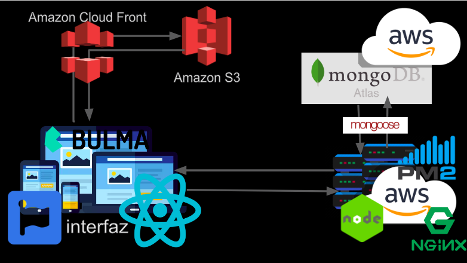

# react-restaurant

A restaurant system written in javaScript 

If you want to give a try to this API please visite the [postman collection here](https://documenter.getpostman.com/view/1215959/RWguxHLk), where you can download the collection and run it in your local postman or just see some request examples in diferent languajes like NodeJS, Go, Python or using cURL command

### Resources:
- [Webapp](http://restaurant.devcharles.com)
- [github repo](https://github.com/devCharles/react-restaurant)
- [postman collection](https://documenter.getpostman.com/view/1215959/RWguxHLk)

Hope you like it!

## Stack

- Front end
    - React
    - Bulma

- Back end
    - NodeJS
    - Koa
    - MongoDB
    - Mongoose

##  Architecture



## setup instructions (API)
First al all we have to clone this repo and cd in to the API project
```
git clone https://github.com/devCharles/react-restaurant && cd react-restaurant/api
```

Then we have to create a .env file
```
touch .env
```

and put these entries on it
```
PORT=8080
DB_USER=''
DB_PASSWORD=''

```

Now we can install all the nescesary packages:
```
npm i
```

To set up the server with a deamon:
```
npm run dev
```

or just
```
npm start 
```
to run the index file, so taht we can se the API is running in the port 8080 in localhost

To generate documentation in html run
```
npm run docs
```

## setup instructions (WEBAPP)
First al all we have to clone this repo and cd in to the API project

```
git clone https://github.com/devCharles/react-restaurant && cd react-restaurant/webapp
```

Now we can install all the nescesary packages:
```
npm i
```

Now just run the following command and enjoy
```
npm start
```